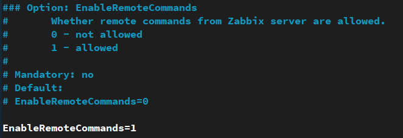
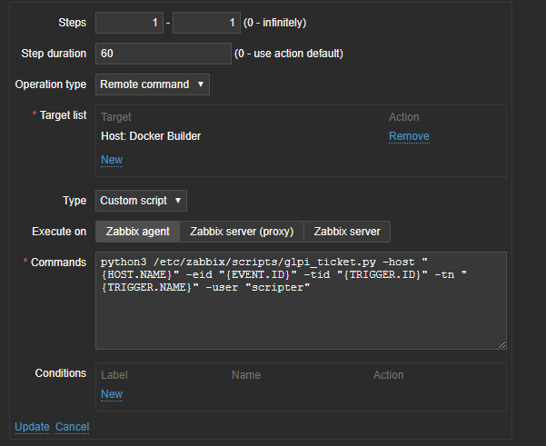
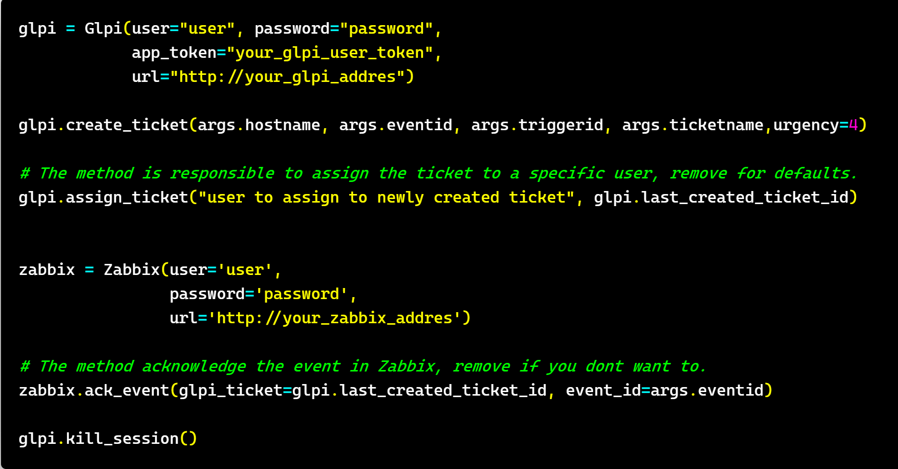

# Open GLPI tickets based on Zabbix events

The idea was inspired and renovated from this project https://github.com/janssenlima/zabbix-glpi

Special thanks to jassenlima

- http://janssenlima.blogspot.com
- https://github.com/janssenlima
- janssenreislima@gmail.com

Any ideas of how to integrate actions and hosts beetwen the 2 systems are always welcome. 

#### Tested Versions

- Zabbix -> from 3.2 to 4.4.5
- GLPI -> 9.4.5  
- GLPI Web Services Plugin -> 2.0.0

## Script requirments

- Machine with python3 and zabbix-agent installed

## Install 

```bash
sudo apt install python3-pip
sudo pip3 install requests 
git clone https://github.com/ihatemodels/zabbix2glpi.git
cd zabbix2glpi/ 
sudo mv glpi_ticket.py glpi.py zabbix.py  /etc/zabbix/scripts/
sudo chown -R zabbix:zabbix /etc/zabbix/
sudo chmod +x /etc/zabbix/scripts/glpi_ticket.py
```
## Usage

```bash 
python3 glpi_ticket.py --help

usage: glpi_ticket.py [-h] --hostname HOSTNAME --eventid EVENTID --triggerid
                      TRIGGERID --ticketname TICKETNAME
                      [--ticketuser TICKETUSER]

Open glpi tickets based on zabbix triggers

optional arguments:
  -h, --help            show this help message and exit
  --hostname HOSTNAME, -host HOSTNAME (required)
                        Zabbix hostname Macro: {HOST.NAME}
  --eventid EVENTID, -eid EVENTID (required)
                        Zabbix event-id, Macro: {EVENT.ID}
  --triggerid TRIGGERID, -tid TRIGGERID (required)
                        Zabbix trigger-id, Macro: {TRIGGER.ID}
  --ticketname TICKETNAME, -tn TICKETNAME (required)
                        GLPI Ticket name, can be Zabbix Macro {TRIGGER.NAME}
  --ticketuser TICKETUSER, -user TICKETUSER
                        Assign the ticket to specific GLPI user
```

## Configure zabbix 

- Enable RemoteCommands in /etc/zabbix/zabbix_agentd.conf at the machine from where you will execute the script.



- Restart Zabbix Agent

```bash
sudo systemctl restart zabbix-agent.service
```

- Choose an action and under Operations create a new one to execute the script as follows. From Target list choose the host where the scripts is located. Set the desired GLPI user and paste the following command. 

```bash 
python3 /etc/zabbix/scripts/glpi_ticket.py -host "{HOST.NAME}" -eid "{EVENT.ID}" -tid "{TRIGGER.ID}" -tn "{TRIGGER.NAME}" -user "UserName in GLPI to assign the ticket"
```



## Configure the script at glpi_ticket.py

- Assigning the ticket and event acknowledgement are optional actions and can be skipped. 

- Choosing the username to assign the ticket can be achieved via string representation of the GLPI user. The Glpi class is handaling the rest. 

>  -user TICKETUSER  



## Show Time

- Glpi  

  


- Zabbix 


## Glpi class

```python
 >>> glpi = Glpi()
 >>> print(glpi)
GLPI Users(username:userid): {'glpi': '2', 'post-only': '3', 'tech': '4', 'normal': '5' 'Plugin_FusionInventory': '6', 'scripter': '8'}
Username: glpi
Session_token: rcfnkbqn46i6pv2gi2raq184am
Url: http://my.awesome.glpi.com
WebServices Url: http://my.awesome.glpi.com/glpi/plugins/webservices/rest.php?
```
